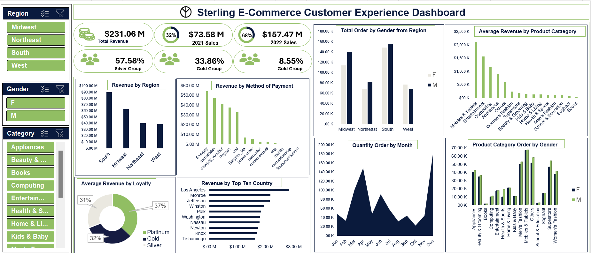

# Sterling E-Commerce Sales Report

**_Disclaimer_** : _All dataset and report does not represent any compnay, institution or country. It is just a dummy dataset to showcase the functional capabilities of Excel.

## Introduction

This is a sales report of a fast-growing company Sterling E-commerce, poised to harness the power of data for unprecedented growth and enhance efficiency and customer experience.

## Problem Statement

1. To optimize product offerings.
2. Streamline operations.
3. Enhance customer experience.

## Skills Demonstrated
This dashboard was completed using Excel. The following Excel features were incorporated.

-	IF function
-	COUNTBLANK
-	Average
-	Max

## Insights

1. Mobile and tablets generate the highest number of orders, contributing an average revenue of $2,110k to the company's total revenue, surpassing all other product categories.
2. The top 5 performing products are Mobile and Tablets, Entertainment, Computing, Appliances and Others.
3. A significant portion of the company's revenue comes from the South region, amounting to $89.64 million, followed by the Midwest with $62.92 million. The Northeast and West regions are closely matched, with revenues of $39.96 million and $38.53 million, respectively.
4. Despite being the least in the count, the Platinum customer contributed the most to the company's average revenue, accounting for 37% of Sterling's total revenue. Gold follows with 32%, and Silver with 31%.
5. The most utilized payment method is EasyPay, which has generated $54.19 million in transactions.

 ## Conclusion and Strategic Recommendations
 After a detailed analytical review of Sterling's data, the following strategic recommendations is expected to positioned Sterling at a better competitive advantage and further enjoys market dominance.
 
1. Given clear indications of customers spending more on Mobile & Tablets, launching a new Mobile and Tablet product or enhancing existing ones is crucial to sustaining the market dominance the company currently enjoys.
2. With a substantial portion of revenue realized from the South and Midwest regions, directing resources to these areas for targeted and strategic marketing, distribution, and exceptional customer service engagement is imperative.
3. A re-evaluation of marketing strategies for the least performing product categories is necessary to optimize future performance.
4. A promotional offering as an incentive for the most performing customer group and encourage the least performing customer group.
